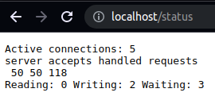
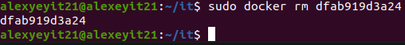

## Part 1. Готовый докер
##### Взять официальный докер образ с **nginx** и выкачать его при помощи `docker pull`
- Установим docker на компьютере командой `sudo snap install docker`
    - 
- Посмотрим все доступные образы nginx командой `sudo docker research nginx`
    - 
- Возьмем официальный docker образ nginx и выкачаем его командой `docker pull nginx`
    - 
##### Проверить наличие докер образа через `docker images nginx`
- 
##### Запустить докер образ через `sudo docker run -d [image_id|repository]`, командой `docker run -d 2b7d6430f78d nginx`
- 
##### Проверить, что образ запустился через `sudo docker ps`
- 
##### Посмотреть информацию о контейнере через `docker inspect [container_id|container_name]` командой `sudo docker inspect 886adc7f867c`
- 
- Размер контейнера выводиться в байтах на скриншоте указан размер 67108864 что можно перевести в мегабайты и получить 67108864/1024/1024=64 МБ 
    - 
- 
- 
##### Остановить докер образ через `docker stop [container_id|container_name]` командой `sudo docker stop 886adc7f867c`
- 
##### Проверить, что образ остановился через `docker ps` командой `sudo docker ps`
- 
##### Запустить докер с замапленными портами 80 и 443 на локальную машину через команду *run* командой `sudo docker run -p 80:80/tcp -p 443:443/tcp -d 2b7d6430f78d`
- 
##### Проверить, что в браузере по адресу *localhost:80* доступна стартовая страница **nginx**
- 
##### Перезапустить докер контейнер через `docker restart [container_id|container_name]` комндой `sudo docker restart 41f0e59e10f6` и проверить, что контейнер запустился командой `sudo docker ps`
- 

## Part 2. Операции с контейнером
##### Прочитать конфигурационный файл *nginx.conf* внутри докер образа через команду *exec* командой `sudo docker exec dfab919d3a24 cat ./etc/nginx/nginx.conf`
- 
##### Создать на локальной машине файл *nginx.conf* и настройка в нем по пути */status* отдачу страницы статуса сервера **nginx**
- 
- Cоздать на локальной машине файл default.conf c конфигурацией на скриншоте
- 
##### Скопировать созданный файл *nginx.conf* внутрь докер образа через команду `docker cp` командой `sudo docker cp it/DO5_SimpleDocker-0/src/nginx.conf dfab919d3a24:/etc/nginx/nginx.conf`
##### Скопировать созданный файл *default.conf* внутрь докер образа через команду `docker cp` командой `sudo docker cp it/DO5_SimpleDocker-0/src/default.conf dfab919d3a24:/etc/nginx/conf.d/default.conf`
- 
- 
##### Перезапустить **nginx** внутри докер образа через команду *exec* командой `sudo docker exec dfab919d3a24 nginx -s reload`
- 
##### Проверить, что по адресу *localhost:80/status* отдается страничка со статусом сервера **nginx**
- 
##### Экспортировать контейнер в файл *container.tar* через команду *export* командой `sudo docker export dfab919d3a24 > cont.tar`
- 
##### Остановить контейнер командой `sudo docker stop dfab919d3a24`
- 
##### Удалить образ через `docker rmi [image_id|repository]`, не удаляя перед этим контейнеры командой `sudo docker rmi -f 2b7d6430f78d`
- 
##### Удалить остановленный контейнер командой `sudo docker rm dfab919d3a24`
- 
##### Импортировать контейнер обратно через команду *import* командой `sudo docker import cont.tar ngin`
- 
##### Запустить импортированный контейнер командой `sudo docker run -p 80:80/tcp -p 443:443/tcp -dit my_ngin /bin/bash` и запустить сервер командой `sudo docker exec 160032eb14ff service nginx start`
- 
- 
##### Проверить, что по адресу *localhost:80/status* отдается страничка со статусом сервера **nginx**
- 
