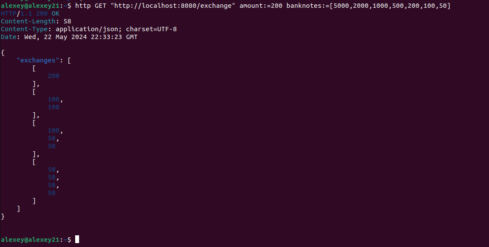

# Go API Server exchange-service

## Конфигурация

- golang: 1.22
- VsCode

## Overview

Всего 1 эндпоинтов:

- `GET /exchange`

Количество денег и банкноты должны подаваться в теле запроса.


### Запуск сервера
Для работы с сервером предоставлен Makefile со следующими целями: 
```
run_service // Локальный запуск сервера
```

### Сервер

В качестве маршрутизатора и диспетчера запросов используется пакет 
```
github.com/gorilla/mux
```
Для логгирования используется пакет slog. Уровень логгирования можно задать в env/local/.env файле. Может принимать три значения:
```
INFO, DEBUG, ERROR, WARN
```
```
log/slog
```

Работа сервиса начинается с загрузки параметров окружения из файлов 
```
/env/dev/.env. 
```
Далее регистрируются все эндпоинты. Реализован middleware для логгирования.
Каждый входящий запрос сначала проходит через middleware логгирования.
Таким образом каждый запрос логгируется и записывается в файл:
```
/logs/log.txt
```
Записывается время когда был подан запрос, по какому пути, метод запроса, код возврата запроса и время выполнения запроса.
Пример записи логга для запроса:
```
time=2024-05-23T01:18:48.180+03:00 level=INFO msg="logger middleware enabled"
time=2024-05-23T01:18:48.180+03:00 level=INFO msg="Running http server" address=localhost:8080
time=2024-05-23T01:18:51.179+03:00 level=INFO msg="Request status" Path=/exchange Method=GET status_code=200 elapsed_time=164.3µs
time=2024-05-23T01:19:13.537+03:00 level=INFO msg="Gracefull stopping server" address=localhost:8080
```

Пример запроса:

